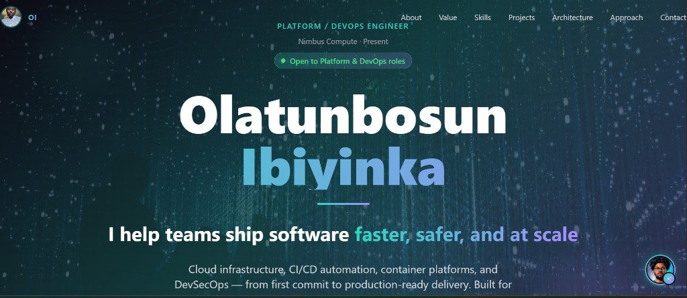
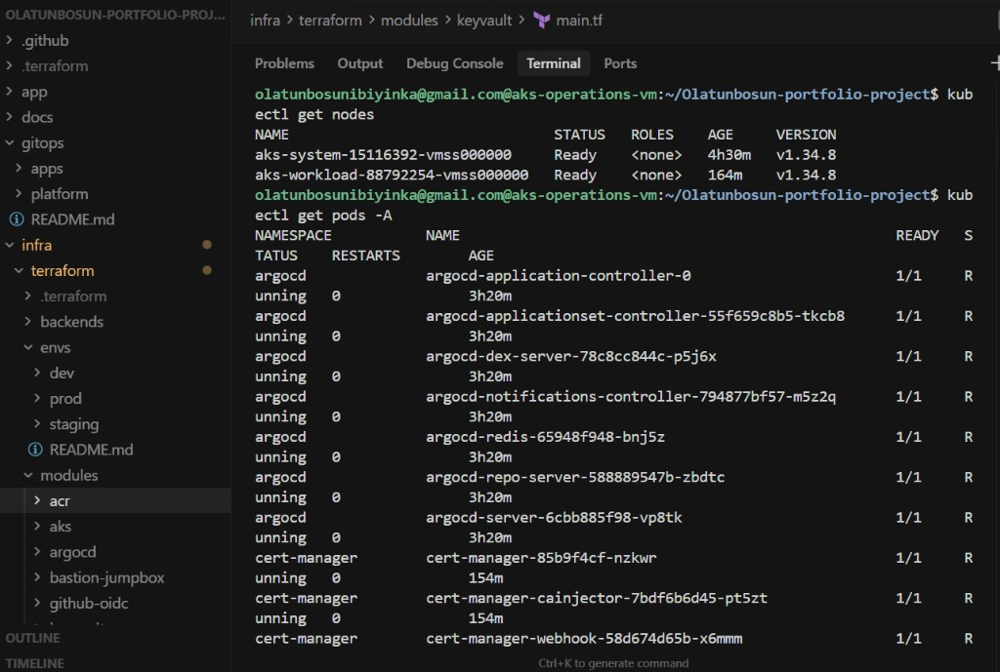
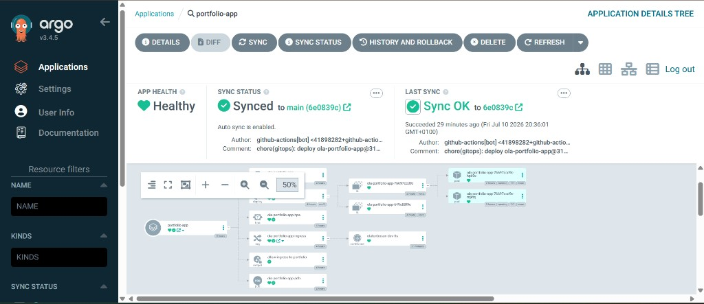
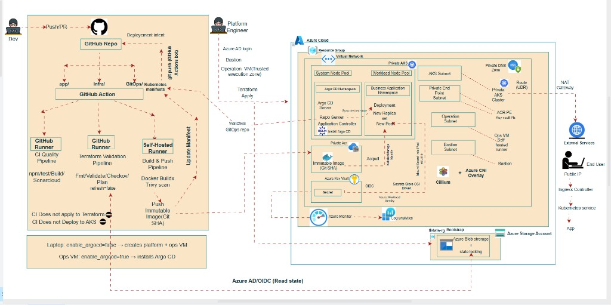

# Olatunbosun Portfolio — Azure Platform Engineering Project

[](https://github.com/OlatunbosunIbiyinka/Olatunbosun-portfolio-project/actions/workflows/ci-build-push.yml)
[](https://github.com/OlatunbosunIbiyinka/Olatunbosun-portfolio-project/actions/workflows/ci.yml)
[](https://github.com/OlatunbosunIbiyinka/Olatunbosun-portfolio-project/actions/workflows/terraform.yml)

**Live site:** [https://olatunbosun.dev](https://olatunbosun.dev) (static — GitHub Pages)

A production-pattern **React portfolio** designed for **private Azure Kubernetes Service (AKS)** — **Terraform**, **GitOps (Argo CD)**, and **GitHub Actions** with OIDC. The full Azure platform is IaC in this repo (recreatable); the public site currently runs as a **static GitHub Pages** deploy so the domain stays live without AKS cost.

---

## Live vs designed

| Capability | Live now | Designed / recreatable |
|------------|----------|------------------------|
| Portfolio UI at [olatunbosun.dev](https://olatunbosun.dev) | **Yes — GitHub Pages** (static) | Same `app/` on private AKS + Ingress + TLS |
| Private AKS + Argo CD + ACR + Bastion | Parked (torn down for cost) | Terraform + GitOps in this repo |
| Outbound (when AKS is up) | — | Bootstrap: `loadBalancer`; Phase 3: `userAssignedNATGateway` |

Screenshots and docs show the full platform. To bring Azure back: follow [docs/QUICK_START.md](docs/QUICK_START.md). Static hosting: [docs/STATIC_SITE.md](docs/STATIC_SITE.md).

### Platform in action



*Live portfolio UI — Platform / DevOps positioning with in-app assistant.*



*Trusted Execution Zone: Bastion → ops VM → `kubectl` against private AKS (system + workload Ready; Argo CD + cert-manager running).*



*GitOps: `portfolio-app` Healthy / Synced from `main` (auto-sync); Ingress, Certificate, HPA, PDB, NetworkPolicy, and pods.*

---

## What this project is

| Layer | Technology | Role |
|-------|------------|------|
| **Application** | React 18 + nginx (port 8080) | Static portfolio SPA |
| **Infrastructure** | Terraform 1.10.5 on Azure | VNet, private AKS, ACR, Key Vault, Bastion, Argo CD |
| **Supply chain** | GitHub Actions (self-hosted runner) | Build, Trivy scan, push immutable images to private ACR |
| **Runtime** | Argo CD (in-cluster) | Reconcile cluster state from Git — CI never deploys directly |

**Design principle:** CI builds and records deploy intent in Git. Argo CD deploys. CI OIDC identity has **no AKS cluster access**.

---

## Architecture



*Platform diagram (designed end-state). What is live on dev today is in [Live vs designed](#live-vs-designed).*

```
Developer push (app/ or infra/)
        │
        ├─ app/** ──► ci.yml (quality)            ── GitHub-hosted
        │             ci-build-push.yml (release) ── self-hosted runner (ops VM, VNet)
        │
        └─ infra/** ─► terraform.yml (IaC)        ── GitHub-hosted

Release path (ci-build-push.yml):
  Buildx → Trivy gate → push ola-portfolio-app:{git-sha} → ACR (private)
        → update gitops/apps/portfolio-app/deployment.yaml
        → bot commit to main
        → Argo CD syncs → AKS rolling update
        → smoke test (VM MI + kubectl + /health)

Infrastructure (manual apply from ops VM / Bastion path):
  Terraform → Azure (VNet, private endpoints, AKS, ACR, KV, Bastion, Argo CD)
```

### Azure platform (Terraform modules)

| Module | Delivers |
|--------|----------|
| `vnet` | VNet `10.0.0.0/16`, subnets, optional user-assigned NAT, NSGs, private DNS |
| `aks` | Private AKS, CNI Overlay; network policy azure (bootstrap) or Cilium (phase 4) |
| `acr` | Premium ACR, private endpoint, optional geo-replication (prod tfvars) |
| `keyvault` | RBAC Key Vault, private endpoint, audit logs |
| `bastion-jumpbox` | Azure Bastion + operations VM (Trusted Execution Zone) |
| `github-oidc` | Federated credentials for GitHub Actions |
| `argocd` | Argo CD Helm release |

### Network layout

| Subnet | CIDR | Purpose |
|--------|------|---------|
| `aks-subnet` | 10.0.1.0/24 | AKS nodes; outbound via `loadBalancer` (or user-assigned NAT when enabled) |
| `private-endpoints` | 10.0.2.0/24 | ACR + Key Vault private endpoints |
| `AzureBastionSubnet` | 10.0.3.0/26 | Bastion |
| `operations-subnet` | 10.0.4.0/24 | Ops VM + self-hosted GitHub runner |

### State management

- Remote backend: Azure Blob (`olaportfolio001` / `tfstate`)
- Auth: Azure AD OIDC (`use_azuread_auth`, `use_oidc`)
- Per-environment keys via `backends/{dev,staging,prod}.hcl` — see [infra/terraform/envs/README.md](infra/terraform/envs/README.md)

---

## CI/CD pipelines

### 1. Deploy static site (`.github/workflows/pages.yml`) — **live path**

| | |
|--|--|
| **Trigger** | `app/**` on push to `main`; `workflow_dispatch` |
| **Runner** | `ubuntu-latest` |
| **Steps** | `npm ci` → build → **GitHub Pages** (`olatunbosun.dev`) |

### 2. CI — Quality (`.github/workflows/ci.yml`)

| | |
|--|--|
| **Trigger** | `app/**` on PR and push |
| **Runner** | `ubuntu-latest` |
| **Steps** | `npm ci` → build → tests → SonarCloud (if `SONAR_TOKEN` set) |

### 3. CI — Build and Push (`.github/workflows/ci-build-push.yml`) — **AKS path (parked)**

| | |
|--|--|
| **Trigger** | `workflow_dispatch` only while Azure is torn down |
| **Runner** | `self-hosted` (operations VM in VNet) |
| **Auth** | GitHub OIDC → ACR push; VM managed identity for smoke test |
| **Steps** | Buildx → **Trivy** → push `{git-sha}` → update GitOps → bot commit → smoke test |

### 4. Terraform Validation (`.github/workflows/terraform.yml`)

| | |
|--|--|
| **Trigger** | `infra/**` on PR and push |
| **Jobs** | fmt → validate → **Checkov** → plan (push only) |
| **Apply** | **Not in CI** — from ops VM |

### GitOps (Argo CD) — when AKS is up

- Application: `gitops/apps/portfolio-app.yaml`
- Manifests: `gitops/apps/portfolio-app/`
- Automated sync; immutable image tags only

See [gitops/README.md](gitops/README.md) and [docs/ADR-ACR-private-build-strategy.md](docs/ADR-ACR-private-build-strategy.md).

---

## Repository structure

```
.
├── app/                          # React portfolio (Dockerfile → nginx:8080)
├── gitops/                       # Argo CD app + platform manifests
├── infra/terraform/              # Modules, envs, backends
├── .github/workflows/            # Quality, release, Terraform validation
├── docs/                         # Architecture, ADR, quick start, domain
│   └── archive/                  # Historical upgrade notes (not current truth)
└── scripts/                      # Ops helpers (bootstrap, runner, stable phases)
```

---

## Quick start

**Fastest path:** [docs/QUICK_START.md](docs/QUICK_START.md) — laptop bootstrap → ops VM GitOps.

```powershell
cd infra/terraform
.\bootstrap-dev.ps1          # Phase 1 (laptop): core infra, Argo off
```

```bash
# Phase 2 (ops VM via Bastion)
bash scripts/phase2-on-vm.sh
bash scripts/install-github-runner.sh   # needs GITHUB_RUNNER_TOKEN
```

Stable hardening (ops VM, one phase at a time): `bash scripts/stable-phase-apply.sh apply <1-5>`

---

## Multi-environment

| Environment | Status |
|-------------|--------|
| **dev** | Live bootstrap / demo |
| **staging** | Codified in `envs/staging/` — not deployed by default |
| **prod** | Codified in `envs/prod/` — includes ACR geo-rep target |

---

## Security model

| Control | Implementation |
|---------|----------------|
| No long-lived cloud secrets in CI | GitHub OIDC |
| CI cannot deploy to cluster | OIDC has no AKS access |
| Private registry | ACR private endpoint |
| Private cluster | AKS API in VNet; Bastion + ops VM |
| Immutable artifacts | Image tags = git SHA |
| Supply chain gates | Trivy, Checkov, SonarCloud (optional) |
| Secrets | Key Vault + Workload Identity + CSI |
| Network | Private endpoints, NSGs; Azure NPM today / Cilium phased |

---

## Documentation

| Document | Description |
|----------|-------------|
| [Architecture & interview guide](docs/ARCHITECTURE_AND_INTERVIEW_PRESENTATION.md) | Walkthrough + presentation notes |
| [Production environment (target)](docs/PRODUCTION_ENVIRONMENT.md) | Prod patterns — not all live on dev |
| [ADR: Private ACR build](docs/ADR-ACR-private-build-strategy.md) | Why self-hosted runner in VNet |
| [Static site (GitHub Pages)](docs/STATIC_SITE.md) | Always-on UI while AKS is parked |
| [Quick start](docs/QUICK_START.md) | Clean AKS bootstrap |
| [Domain setup](docs/DOMAIN_SETUP.md) | Ingress + cert-manager + DNS (AKS path) |
| [OIDC setup](docs/OIDC_SETUP.md) | GitHub ↔ Azure federation |
| [Multi-environment](infra/terraform/envs/README.md) | Dev / staging / prod |
| [Archive](docs/archive/README.md) | Historical notes — not current truth |

---

## Key design decisions

1. **GitOps separation** — CI supplies images; Argo CD reconciles from Git.
2. **Self-hosted runner** — Private ACR needs an in-VNet build path (ADR).
3. **Plan-only Terraform in CI** — Apply from the Trusted Execution Zone.
4. **Phased hardening** — Bootstrap stable first; NAT / Cilium / policy in controlled phases.
5. **Immutable SHA tags** — Auditable rollback via Git.

---

## Author

**Olatunbosun Ibiyinka** — Platform / DevOps Engineer

- Live: [olatunbosun.dev](https://olatunbosun.dev)
- [GitHub](https://github.com/OlatunbosunIbiyinka)
- [LinkedIn](https://www.linkedin.com/in/olatunbosun-ibiyinka)

---

## License

[MIT](LICENSE) © 2026 Olatunbosun Ibiyinka

---

*Last updated: July 2026*
