# End-to-End Architecture & 10-Minute Interview Presentation

> **Purpose:** A Principal-engineer-grade walkthrough of this portfolio platform — from Terraform bootstrap through GitOps delivery, security, monitoring, and recovery — with a timed presentation script aligned to the assessment brief.

---

## Table of Contents

1. [Executive Summary](#1-executive-summary)
2. [Architecture at a Glance](#2-architecture-at-a-glance)
3. [The Plumbing — Layer by Layer](#3-the-plumbing--layer-by-layer)
4. [Assessment Brief Coverage Matrix](#4-assessment-brief-coverage-matrix)
5. [10-Minute Presentation Script](#5-10-minute-presentation-script)
6. [Demonstration Checklist](#6-demonstration-checklist)
7. [Appendix](#7-appendix)

---

## 1. Executive Summary

This project is an **Azure-native, private Kubernetes platform** that provisions infrastructure with **Terraform 1.10.5**, validates it in **GitHub Actions**, and delivers a React portfolio application via **GitOps (Argo CD)**. The design deliberately separates three concerns:

| Plane | Responsibility | Tooling |
|-------|----------------|---------|
| **Infrastructure** | Network, identity, cluster, registry, secrets platform | Terraform modules + manual/staged apply |
| **Supply chain** | Build, scan, push immutable images | GitHub Actions (self-hosted runner in VNet) |
| **Runtime** | Deploy, reconcile, heal workloads | Argo CD in-cluster |

**Why this impresses at Principal level:** Security is structural, not bolted on. CI never holds cluster credentials. Private endpoints, Workload Identity, Cilium network policy, and OIDC federation are first-class design constraints — not afterthoughts. The trade-offs (plan-only CI for infra, self-hosted runner for private ACR) are documented with ADRs and enforced in code.

**Honest scope note:** **Dev is deployed** (`uksouth`). **Staging and prod are designed and codified** in `envs/staging/` and `envs/prod/` with isolated state keys and production DR settings (ACR geo-replication, Key Vault purge protection) — ready to apply, not yet provisioned.

---

## 2. Architecture at a Glance

### 2.1 Full Stack — Control & Data Flow

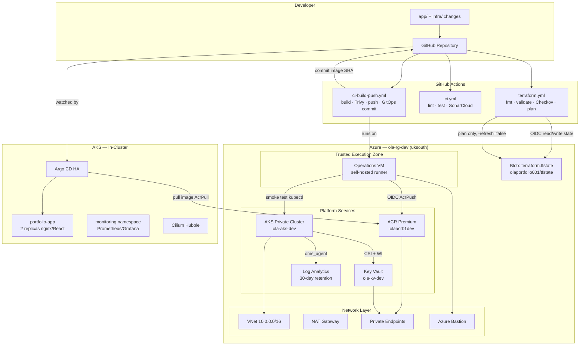

### 2.2 Three Pipelines, One Repository

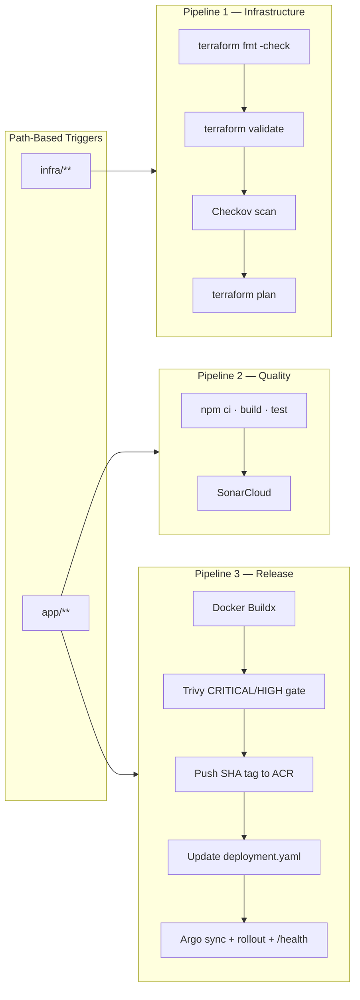

**Key design choice:** Pipelines 2 and 3 run **in parallel** — no `needs:` dependency. Quality gates do not block the release path; Trivy is the hard security gate before push.

### 2.3 Network Topology

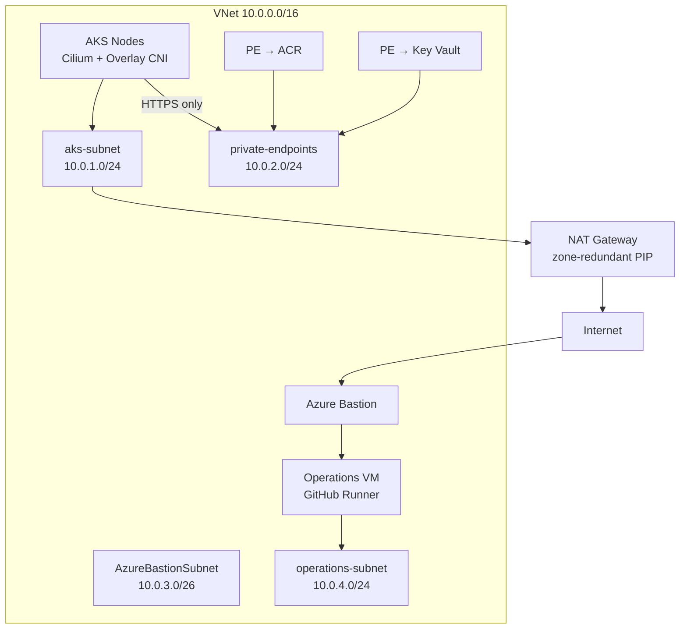

| Subnet | Role |
|--------|------|
| `aks-subnet` | AKS node pools; outbound via NAT Gateway (`userDefinedRouting`) |
| `private-endpoints` | ACR + Key Vault private endpoints; NSG allows HTTPS from AKS subnet only |
| `AzureBastionSubnet` | Managed Bastion — no public IP on ops VM |
| `operations-subnet` | Jumpbox / self-hosted CI runner |

### 2.4 Identity & Trust Boundaries

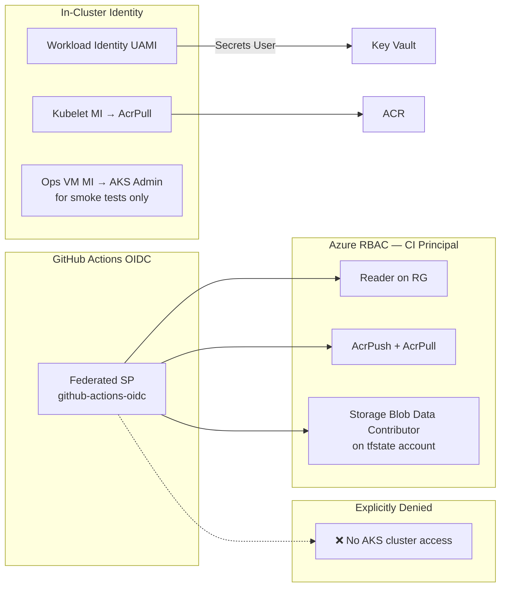

---

## 3. The Plumbing — Layer by Layer

### 3.1 Terraform Implementation

#### Version & providers

| Component | Version / constraint |
|-----------|---------------------|
| Terraform | `>= 1.0` (code); **1.10.5** pinned in CI |
| azurerm | `>= 3.0` |
| azuread | `>= 2.0` |
| kubernetes / helm | `>= 2.0` / `>= 2.17.0, < 3.0.0` |

#### Module composition (single root module)

```
infra/terraform/
├── main.tf              # Provider config, module wiring, Workload Identity
├── backend.tf           # Remote state (azurerm)
├── variables.tf         # ~637 lines — enterprise defaults
├── output.tf            # Cluster, ACR, KV, OIDC outputs for CI/ops
├── argocd.tf            # Argo CD feature flag
├── modules/
│   ├── vnet/            # VNet, subnets, NAT, NSG, private DNS
│   ├── aks/             # Private AKS, Cilium, node pools, CSI driver
│   ├── acr/             # Premium ACR + private endpoint
│   ├── keyvault/        # RBAC Key Vault + PE + diagnostics
│   ├── github-oidc/     # Federated credentials for CI
│   ├── bastion-jumpbox/ # Trusted Execution Zone
│   └── argocd/          # Helm release (HA)
└── envs/dev/
    ├── terraform.tfvars         # Local secrets (gitignored)
    └── terraform.tfvars.example # Committed; CI plan source
```

**Apply command:**
```bash
cd infra/terraform
terraform apply -var-file="envs/dev/terraform.tfvars"
```

**Staged production deploy** (`enterprise-deploy.ps1`):

| Stage | What gets provisioned |
|-------|----------------------|
| 1 | Pre-flight: Azure login, soft-deleted KV purge, orphaned AD app check |
| 2 | Foundation: Resource Group, VNet, NSGs, NAT Gateway |
| 3 | Security & Storage: Key Vault, ACR, Private Endpoints, DNS |
| 4 | Access: Bastion + Operations VM (+ tooling extensions) |
| 5 | AKS + monitoring agents + Argo CD |

Stages persist to `.deployment-state.json` — **resume from failed stage** without replaying successful work.

#### Resources provisioned (dev, all features enabled)

| Category | Azure resources |
|----------|----------------|
| Foundation | Resource Group, Log Analytics Workspace |
| Network | VNet, 4 subnets, NAT Gateway + PIP, route table, 2 private DNS zones, NSGs |
| Compute | AKS (system + workload node pools), Bastion, Linux ops VM |
| Registry & secrets | ACR Premium, Key Vault |
| Identity | Workload Identity UAMI, GitHub OIDC app + federated credentials, ~15 role assignments |
| GitOps | Argo CD Helm release (HA: 2 replicas, redis-ha × 3) |

**Not provisioned:** Managed database, Application Gateway, Azure Backup vault, multi-region replication (supported in modules, not enabled).

---

### 3.2 State File Management

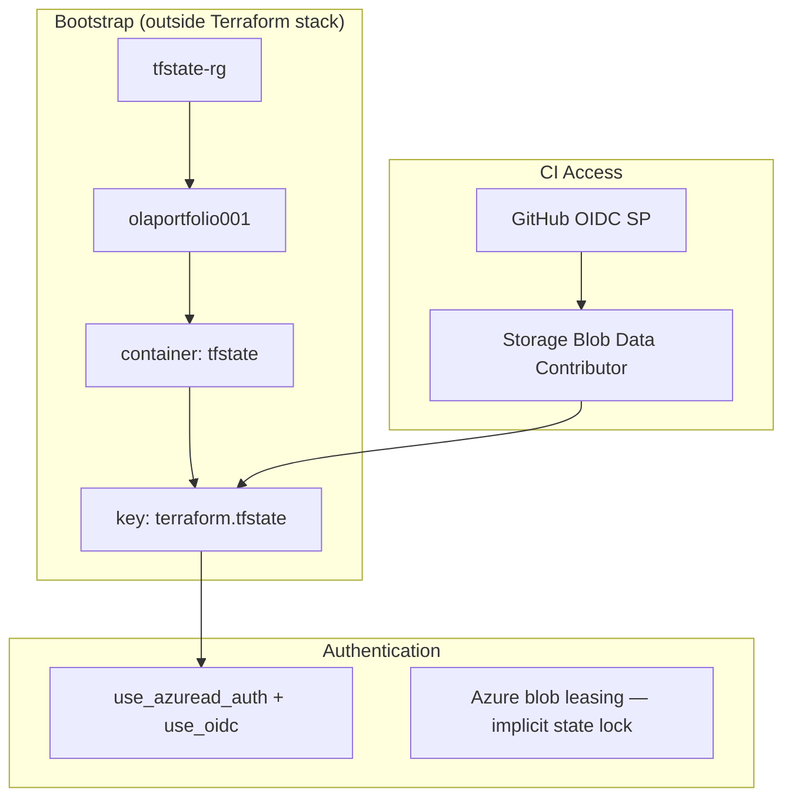

**Configuration** (`infra/terraform/backend.tf`):

```hcl
terraform {
  backend "azurerm" {
    resource_group_name  = "tfstate-rg"
    storage_account_name = "olaportfolio001"
    container_name       = "tfstate"
    key                  = "terraform.tfstate"
    use_azuread_auth     = true
    use_oidc             = true
  }
}
```

| Decision | Rationale |
|----------|-----------|
| Remote backend in Azure Blob | Durable, encrypted, team-shared state |
| OIDC auth (no storage keys in CI) | Short-lived tokens; no long-lived secrets |
| Single state blob (monolithic root) | Simplicity for portfolio; all modules share one graph |
| Bootstrap stack external | State storage must exist before first `terraform init` |
| `-refresh=false` in CI plan | Private AKS API unreachable from GitHub-hosted runners |

**Production evolution path:**
- Separate state keys per environment: `dev/terraform.tfstate`, `prod/terraform.tfstate`
- Enable blob versioning + soft delete on state account
- Optional: Terraform Cloud for run history and policy-as-code

**Recovery command:**
```bash
terraform state pull > backup-$(date +%Y%m%d).tfstate
```

---

### 3.3 Key Provisioning Considerations

| Consideration | How it is handled |
|---------------|-------------------|
| **Dependency ordering** | `enterprise-deploy.ps1` stages; NAT before AKS outbound routing |
| **Long-running AKS** | Extended timeouts (create 240m, update 180m) in AKS module |
| **Circular deps** | Key Vault RBAC granted to deploying principal first; Argo CD deferred option via `apply-without-argocd.ps1` |
| **Soft-deleted Key Vault** | Pre-flight purge in enterprise-deploy; `recover_soft_deleted_key_vaults = true` |
| **IP exhaustion** | Azure CNI Overlay mode — pods on `10.244.0.0/16` overlay |
| **System vs workload isolation** | Dedicated system pool with `CriticalAddonsOnly` taint; workload pool for apps |
| **Destroy safety** | `safe-destroy.ps1`; KV `purge_soft_delete_on_destroy = false` |
| **Private cluster ops** | Bastion + ops VM with AKS admin MI; all human/CI kubectl from VNet |

---

### 3.4 Security Considerations

#### Infrastructure security

| Layer | Control |
|-------|---------|
| **Network** | Private AKS API; private endpoints for ACR/KV; NSG deny-by-default on PE subnet |
| **Identity** | Azure RBAC for K8s API; local accounts disabled; AAD group-based admin |
| **Registry** | ACR admin disabled; Premium SKU; public access disabled in dev |
| **Secrets** | Key Vault RBAC; network default Deny; audit logs to Log Analytics |
| **Policy** | Azure Policy enabled on AKS; Gatekeeper constraint examples in `k8s/` |
| **Pod security** | Non-root nginx user; read-only root FS patterns in hardened `k8s/deployment.yaml` |
| **Network policy** | Cilium engine; default-deny policies in `k8s/networkpolicy*.yaml` |

#### Sensitive data & credentials

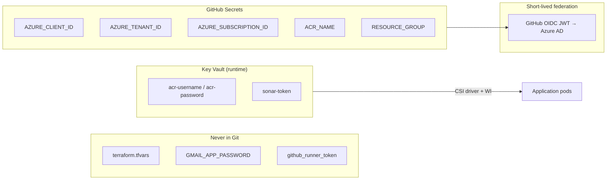

| Secret type | Storage | Access method |
|-------------|---------|---------------|
| Azure subscription IDs | GitHub encrypted secrets | Workflow `env` |
| ACR push (CI) | OIDC federated credential | `azure/login@v2` — no SP password |
| App/tooling secrets | Key Vault | `SecretProviderClass` + Workload Identity |
| Terraform vars with secrets | Local `terraform.tfvars` (gitignored) | Operator workstation / ops VM |
| State file | Encrypted blob storage | Azure AD RBAC |

#### IaC security scanning

**Checkov** runs on every infra change with `soft_fail: false`. Dev trade-offs are documented in `infra/checkov.suppressions.yaml` (27 suppressions with justification — e.g., portfolio dev environment, private endpoint patterns).

---

### 3.5 Application Delivery (GitOps)

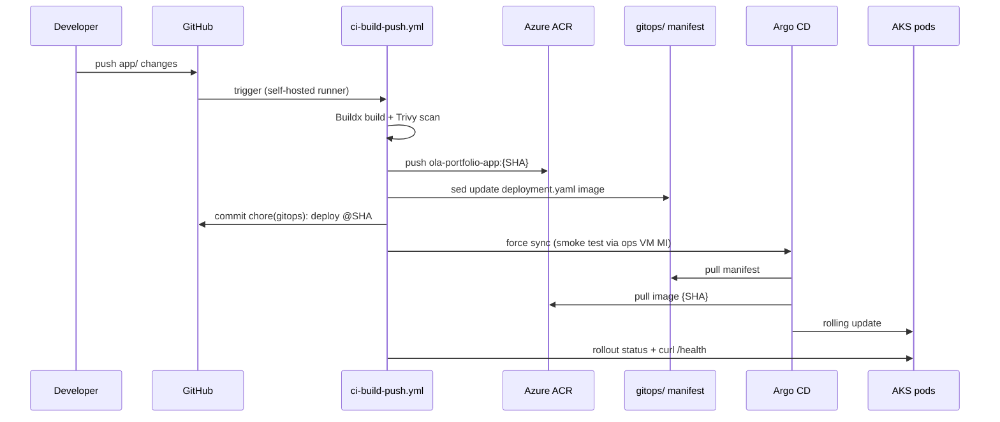

**Argo CD Application** (`gitops/apps/portfolio-app.yaml`):

| Setting | Value | Why |
|---------|-------|-----|
| `automated.prune` | `true` | Remove resources deleted from Git |
| `automated.selfHeal` | `true` | Correct cluster drift |
| `revisionHistoryLimit` | `10` | Rollback history |
| `PrunePropagationPolicy` | `foreground` | Safe deletion ordering |

**Immutable tagging:** Every deployment references `ola-portfolio-app:<git-sha>`. No `latest` push in CI.

**Path filter prevents loops:** `ci-build-push.yml` triggers on `app/**` only — GitOps bot commits do not re-trigger builds.

---

### 3.6 Monitoring & Observability

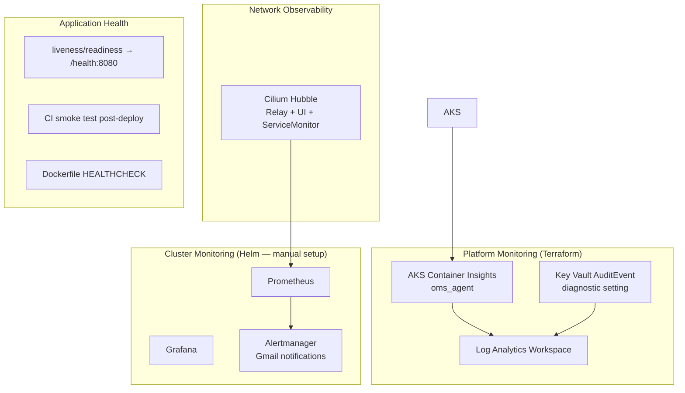

| Signal type | Tool | Status |
|-------------|------|--------|
| **Metrics** | Prometheus (kube-prometheus-stack) | Manual install via `monitoring-setup/setup-monitoring.py` |
| **Dashboards** | Grafana (LoadBalancer exposure) | Same |
| **Alerts** | Alertmanager → Gmail | Requires `GMAIL_APP_PASSWORD` env var |
| **Platform logs** | Azure Log Analytics + Container Insights | Provisioned by Terraform |
| **Network flows** | Cilium Hubble | Optional Helm install |
| **Audit** | Key Vault → Log Analytics | Terraform diagnostic setting |
| **Deploy verification** | CI smoke test | Automated in `ci-build-push.yml` |

**Gap to acknowledge confidently:** App-level Prometheus metrics/ServiceMonitor not yet wired for the portfolio SPA. The hardened `k8s/` manifests include `networkpolicy-prometheus-allow.yaml` anticipating this.

---

### 3.7 Multi-Environment & Disaster Recovery Design

> **Label for interviews:** *Designed & codified — dev deployed.*

#### Environment layout

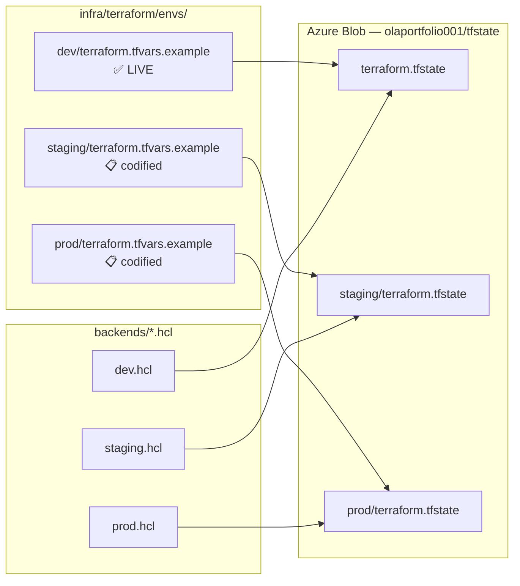

| Environment | State key | Deployed? | Purpose |
|-------------|-----------|-----------|---------|
| **dev** | `terraform.tfstate` | **Yes** | Active development and interview demos |
| **staging** | `staging/terraform.tfstate` | No | Pre-prod validation; prod-like security (`purge_protection = true`) |
| **prod** | `prod/terraform.tfstate` | No | Production footprint + geo-DR |

**Apply (when ready — no deploy required for the interview story):**

```bash
# Staging
terraform init -reconfigure -backend-config=backends/staging.hcl
terraform plan -var-file="envs/staging/terraform.tfvars"

# Production
terraform init -reconfigure -backend-config=backends/prod.hcl
terraform plan -var-file="envs/prod/terraform.tfvars"
```

Full workflow: `infra/terraform/envs/README.md`.

#### Per-environment differences (codified in tfvars)

| Setting | Dev | Staging | Prod |
|---------|-----|---------|------|
| Resource group | `ola-rg-dev` | `ola-rg-staging` | `ola-rg-prod` |
| Key Vault purge protection | `false` (easy destroy) | `true` | `true` |
| ACR geo-replication | `[]` | `[]` | `["northeurope"]` |
| Workload pool `min_count` | 1 | 2 | 2 |
| Workload pool `max_count` | 5 | 8 | 10 |
| GitHub OIDC app | `github-actions-oidc` | `...-staging` | `...-prod` |
| OIDC subjects | `main`, `develop`, PR | `main`, `develop` | `main` + `environment:production` |

Root module wires geo-replication via `acr_georeplications` → ACR Premium module.

#### Geo-DR architecture (production)

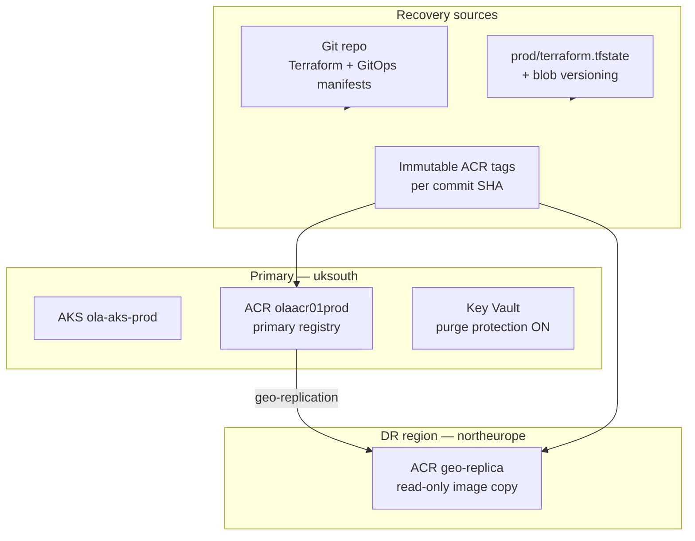

| DR layer | Mechanism | RPO / RTO intent |
|----------|-----------|------------------|
| **Infrastructure** | `terraform apply` from Git + state backup | RPO: last state snapshot; RTO: ~hours (staged deploy) |
| **Container images** | ACR geo-replication to `northeurope` | RPO: near-zero for pushed images |
| **Secrets** | Key Vault soft delete (7d) + purge protection | Prevents accidental permanent deletion |
| **Application** | Stateless React SPA; GitOps SHA tags | RPO: 0 (Git is source of truth) |
| **State file** | Blob versioning on bootstrap account (manual enable) | Point-in-time state recovery |

**Not in scope (say if asked):** Multi-region active-active AKS, Azure Site Recovery for VMs, automated failover runbooks — documented as future hardening.

#### How to present this without overselling

| Panel question | Answer |
|----------------|--------|
| "Do you run prod?" | "Dev is live. Staging and prod are fully parameterised — separate state keys, tfvars, and DR settings. Deployment is `terraform apply -var-file`, not a redesign." |
| "Why not deploy prod?" | "Cost and sandbox limits for a portfolio project. The IaC is production-pattern; I validate with `terraform plan`." |
| "How does geo-DR work?" | "ACR Premium geo-replicates to `northeurope`. If `uksouth` is impaired, images remain pullable from the replica. Platform recovery is IaC + state restore." |
| "How do envs not collide?" | "Separate blob keys under the same state account, selected via `backends/<env>.hcl` on `terraform init`." |

---

### 3.8 Backup, Rollback & Deployment Resilience

#### Backup approaches

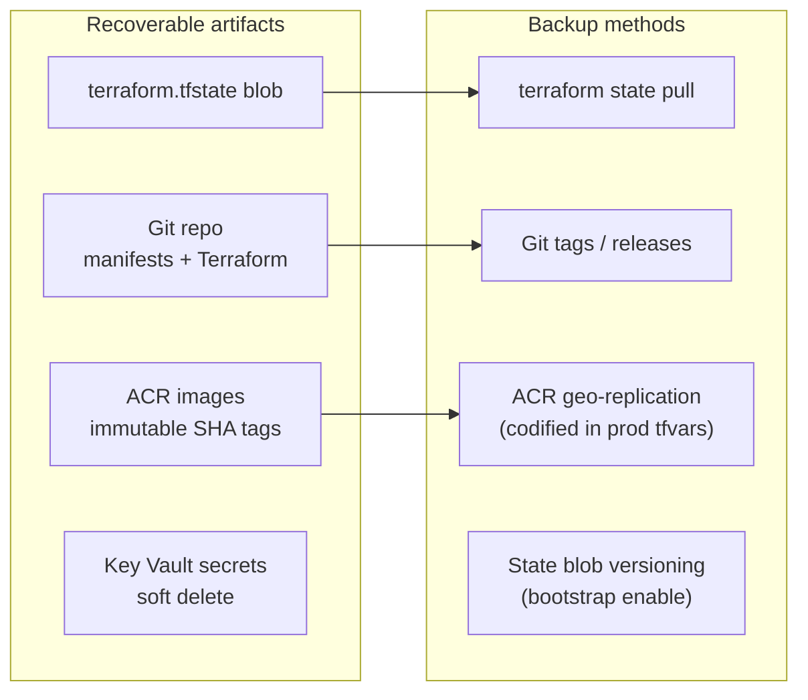

**Infrastructure as Code for recovery:** The entire platform is reproducible from Git. Given a backed-up state file (or fresh state import), `terraform apply` recreates the Azure footprint. Application state is stateless (static React SPA) — no database recovery required.

#### Rollback & deployment resilience

| Layer | Failure mode | Remediation |
|-------|-------------|-------------|
| **Build** | npm test fails (`ci.yml`) | No image produced; cluster unchanged |
| **Security gate** | Trivy CRITICAL/HIGH | Build fails **before** push — bad image never reaches ACR |
| **Push** | ACR unavailable | Workflow fails; GitOps manifest not updated |
| **GitOps** | Bad image deployed | Revert Git commit or set previous SHA in `deployment.yaml`; Argo self-heals |
| **Kubernetes** | Rollout stuck | `kubectl rollout undo deployment/ola-portfolio-app -n portfolio-app` |
| **Argo CD** | Sync failure | `argocd app sync portfolio-app` or CI smoke test forces sync |
| **Smoke test** | Health check fails | Workflow exits 1; **manual** Git revert required (no auto-rollback in CI) |
| **Terraform** | Stage N fails | `enterprise-deploy.ps1 -Stage N` resumes; state lock via blob lease |
| **Terraform** | Bad infra change | `terraform apply` previous git ref; or `terraform state` surgical fixes |

**Kubernetes resilience patterns** (in `k8s/` — reference architecture):

- 2+ replicas, PodDisruptionBudget (`minAvailable: 1`)
- HPA (2–10 pods, CPU 70% / memory 80%)
- Rolling update: `maxUnavailable: 0` (zero-downtime intent)
- Pod anti-affinity across nodes

---

### 3.9 CI/CD Pipeline — Tooling & Stages

#### Tooling summary

| Category | Tool |
|----------|------|
| CI/CD platform | GitHub Actions |
| IaC | Terraform 1.10.5 |
| IaC security | Checkov |
| Image security | Trivy |
| Code quality | ESLint, Jest, SonarCloud |
| Container build | Docker Buildx + ACR registry cache |
| GitOps | Argo CD (Helm via Terraform) |
| Cloud auth | GitHub OIDC → Azure AD |
| Orchestration | AKS (private, Cilium) |
| Registry | ACR Premium |

#### Pipeline 1: `terraform.yml` (infrastructure)

| Job | Trigger | Runner | Steps |
|-----|---------|--------|-------|
| `terraform-fmt-validate` | PR + push | `ubuntu-latest` | fmt → init -backend=false → validate |
| `checkov` | PR + push | `ubuntu-latest` | Scan `./infra`, hard fail |
| `terraform-plan` | push + dispatch only | `ubuntu-latest` | OIDC init → plan -refresh=false → upload artifact |

**Deliberate gap:** No `terraform apply` in CI. Infrastructure changes require human review and apply from the Trusted Execution Zone.

#### Pipeline 2: `ci.yml` (quality)

| Step | Purpose |
|------|---------|
| `npm ci` | Reproducible dependencies |
| `npm run build` | Compile React app |
| `npm test -- --coverage` | Unit tests |
| SonarCloud | Static analysis (optional if `SONAR_TOKEN` set) |

#### Pipeline 3: `ci-build-push.yml` (release)

| Step | Purpose |
|------|---------|
| Docker Buildx + ACR cache | Fast, reproducible builds |
| Trivy | Block CRITICAL/HIGH vulnerabilities |
| Push `{SHA}` tag | Immutable artifact |
| Update `gitops/.../deployment.yaml` | Git as deployment intent |
| Commit + push | Triggers Argo CD reconciliation |
| Smoke test | Argo sync → rollout status → `/health` |

**Why self-hosted runner:** Private ACR with public access disabled cannot be reached from GitHub-hosted runners. Documented in `docs/ADR-ACR-private-build-strategy.md`. Runner lives on the operations VM inside the VNet.

---

## 4. Assessment Brief Coverage Matrix

Use this table to tick off each requirement during the interview.

| Assessment requirement | Where it lives | Talking point (one line) |
|------------------------|----------------|--------------------------|
| **Terraform implementation** | `infra/terraform/modules/*` | Modular single-root design with 7 reusable modules |
| **Version used** | `terraform.yml` → 1.10.5 | Pinned in CI; `>= 1.0` in code |
| **State file management** | `backend.tf`, OIDC blob access | Azure Blob + OIDC + blob leasing; bootstrap external |
| **Key provisioning considerations** | `enterprise-deploy.ps1`, AKS module | Staged deploy, private cluster, NAT egress, node pool separation |
| **Security considerations** | NSGs, PE, Cilium, RBAC | Defence in depth — network, identity, policy |
| **How infrastructure was secured** | Private AKS/ACR/KV, Bastion access | Zero public cluster API; CI has no AKS RBAC |
| **Sensitive data / credentials** | Key Vault CSI, OIDC, gitignored tfvars | No long-lived credentials in pipelines |
| **Disaster Recovery and backup** | `envs/prod/`, §3.7 | Geo-DR codified: ACR → `northeurope`; KV purge protection |
| **IaC for recovery** | Entire `infra/terraform/` | `terraform apply` restores platform from Git + state |
| **Backup approaches** | State pull, ACR geo-rep in prod tfvars | Blob versioning (bootstrap) + immutable SHA tags |
| **Multi-environment** | `envs/README.md`, `backends/*.hcl` | Dev deployed; staging/prod codified with isolated state |
| **Rollback and deployment resilience** | Argo CD, `kubectl rollout undo` | Git revert is primary; K8s undo is fast path |
| **Failed deployments** | Trivy gate, smoke test, staged TF | Fail before push; smoke test catches runtime failures |
| **Rollback / remediation** | GitOps revert, enterprise-deploy resume | Three-layer rollback: Git → Argo → kubectl |
| **CI/CD pipeline** | `.github/workflows/*` | Three specialised pipelines with path triggers |
| **Tooling used** | See §3.8 | GitHub Actions, Terraform, Argo CD, Trivy, Checkov |
| **Key stages / steps** | See §3.8 tables | Validate → scan → plan/build → GitOps → verify |

---

## 5. 10-Minute Presentation Script

> **Pacing:** ~10 minutes total. Adjust demo sections based on panel interest. Speak to the diagrams in this document (share screen on §2.1 or a slide derived from it).

---

### [0:00 – 0:45] Opening — Set the Scene

**Say:**

> "Thank you for the opportunity. I'm going to walk you through a platform I built on Azure where Terraform provisions the infrastructure, GitHub Actions validates and supplies container images, and Argo CD delivers to a private AKS cluster via GitOps.
>
> The design principle I optimised for is **separation of duties**: CI pushes images but never touches the cluster. That is not just a security nice-to-have — it is structurally enforced through Azure RBAC and network isolation.
>
> I'll cover the Terraform implementation, state management, security, disaster recovery, and how the CI/CD pipelines support resilient deployment."

**Show:** Section 2.1 diagram (Full Stack).

---

### [0:45 – 2:30] Terraform Implementation & State

**Say:**

> "The infrastructure is a **single root module** composed of seven reusable modules: VNet, AKS, ACR, Key Vault, GitHub OIDC, Bastion/Jumpbox, and Argo CD.
>
> I use **Terraform 1.10.5**, pinned in CI, with the AzureRM provider. Everything deploys into `uksouth` under a dedicated resource group.
>
> For **state management**, I use an Azure Blob backend — storage account `olaportfolio001`, container `tfstate`. The backend uses **Azure AD OIDC authentication** — no storage account keys in CI. State locking is implicit via Azure blob leases.
>
> The state storage is **bootstrapped outside the stack** — you cannot create the bucket and store state in it in the same apply. My GitHub OIDC identity has **Storage Blob Data Contributor** on that account so CI can run `terraform plan` against real state.
>
> One important operational constraint: because AKS is a **private cluster**, GitHub-hosted runners cannot reach the Kubernetes API. So CI plans use **`terraform plan -refresh=false`**. That means plans validate intent against state, but won't detect live drift on cluster-scoped resources. Full refresh happens from the operations VM inside the VNet.
>
> For initial provisioning, I wrote **`enterprise-deploy.ps1`** — a five-stage deployment that handles dependency ordering: foundation networking, security services, bastion access, then AKS. If stage 4 fails, I resume with `-Stage 4` without replaying successful stages. State is tracked in `.deployment-state.json`."

**Show:** `backend.tf`, `enterprise-deploy.ps1` stage list, Section 3.2 diagram.

**If asked about multi-env:** "Dev is deployed today. Staging and prod are codified under `envs/staging/` and `envs/prod/` with isolated state keys — `staging/terraform.tfstate` and `prod/terraform.tfstate` — selected via `backends/*.hcl` on init. Prod enables ACR geo-replication to `northeurope`. I haven't provisioned staging/prod to control cost, but `terraform plan` validates the full footprint."

---

### [2:30 – 4:15] Provisioning Considerations & Network

**Say:**

> "Key provisioning decisions:
>
> **First**, Azure CNI **Overlay** with **Cilium** as both dataplane and network policy engine. That avoids VNet IP exhaustion while giving me Kubernetes NetworkPolicy and Hubble observability.
>
> **Second**, a **NAT Gateway** on the AKS subnet for predictable egress IPs — important for allowlisting and auditing outbound traffic.
>
> **Third**, **private endpoints** for ACR and Key Vault. ACR public access is disabled. An NSG on the private endpoint subnet only allows HTTPS from the AKS subnet.
>
> **Fourth**, node pool separation: a **system pool** tainted `CriticalAddonsOnly` for CoreDNS and metrics-server, and a **workload pool** for application pods. That prevents application churn from starving platform components.
>
> **Fifth**, the **Trusted Execution Zone** — an operations VM behind Azure Bastion with no public IP. It hosts the self-hosted GitHub runner and is the only place that can run kubectl against the private API server, aside from in-cluster controllers."

**Show:** Section 2.3 network diagram, `terraform.tfvars.example` node pool config.

---

### [4:15 – 5:45] Security & Credentials

**Say:**

> "Security is layered:
>
> **Identity:** GitHub Actions authenticates via **OIDC federation** — short-lived JWTs, no service principal passwords. The federated identity has **Reader** on the resource group, **AcrPush** on the registry, and blob access for Terraform plan. Critically, **`enable_aks_access = false`** — CI cannot call the Kubernetes API.
>
> **In-cluster:** Workload Identity connects pods to Key Vault. The AKS Key Vault Secrets Provider CSI driver mounts secrets at runtime. No secrets are baked into images.
>
> **Human access:** Azure AD SSH login on the ops VM, through Bastion. AKS uses Azure RBAC with local accounts disabled.
>
> **Supply chain:** Checkov scans every Terraform change with hard fail. Trivy blocks CRITICAL and HIGH vulnerabilities before an image is pushed. Suppressions in `checkov.suppressions.yaml` are documented trade-offs for dev, not silent ignores.
>
> **Sensitive data:** `terraform.tfvars` is gitignored. GitHub holds only subscription-level IDs. Application secrets live in Key Vault. The Gmail app password for Alertmanager is an environment variable on the ops workstation — never committed."

**Show:** Section 2.4 identity diagram, `modules/github-oidc/` role assignments.

---

### [5:45 – 7:15] CI/CD Pipelines & GitOps Delivery

**Say:**

> "I run **three independent pipelines** triggered by path filters:
>
> **One** — `terraform.yml` on `infra/` changes: format check, validate, Checkov, and plan on push. No apply in CI — that is intentional. Infrastructure promotion is a conscious human action from the Trusted Execution Zone.
>
> **Two** — `ci.yml` on `app/` changes: build, test, optional SonarCloud. Runs in parallel with the release pipeline.
>
> **Three** — `ci-build-push.yml`: the release path. It runs on a **self-hosted runner** in the VNet because private ACR is unreachable from GitHub-hosted runners — that is ADR-documented.
>
> The release flow: Buildx build with ACR registry cache → Trivy gate → push immutable **`{git-sha}`** tag → update `gitops/apps/portfolio-app/deployment.yaml` → commit back to Git → smoke test.
>
> The smoke test is worth highlighting: CI switches to the **ops VM managed identity** — not the GitHub OIDC identity — to run kubectl. It forces an Argo CD sync, waits for the deployment image to match the SHA, runs `kubectl rollout status`, and curls `/health` inside the pod.
>
> **Argo CD** watches the `gitops/` path. Automated sync with prune and selfHeal means Git is the source of truth. `revisionHistoryLimit: 10` gives rollback history. Path filters ensure the GitOps bot commit does not re-trigger the build pipeline."

**Show:** Section 2.2 pipeline diagram, Section 3.5 sequence diagram, `ci-build-push.yml` smoke test lines.

---

### [7:15 – 8:30] Monitoring, DR & Rollback

**Say:**

> "**Monitoring** operates at three levels:
>
> Platform: Log Analytics and Container Insights provisioned by Terraform. Key Vault audit events stream to the same workspace.
>
> Cluster: Prometheus, Grafana, and Alertmanager via kube-prometheus-stack — installed from `monitoring-setup/setup-monitoring.py`. Alertmanager sends email via Gmail.
>
> Network: Cilium Hubble for flow visibility, with ServiceMonitor integration for Prometheus.
>
> Deploy-time: the CI smoke test is my deployment health gate.
>
> On **disaster recovery** — dev is what's live, but prod DR is **codified, not hypothetical**. In `envs/prod/terraform.tfvars` I've enabled Key Vault purge protection and ACR geo-replication to `northeurope` — the UK paired region. Recovery is IaC-first: Git plus a backed-up `prod/terraform.tfstate` blob recreates the platform. The app is stateless, so GitOps SHA tags and geo-replicated images are the runtime recovery path. I've also documented blob versioning on the state account as a bootstrap step before first prod apply.
>
> **Rollback** is three-tier:
> 1. **Git revert** on `deployment.yaml` — Argo CD self-heals to the previous SHA.
> 2. **`kubectl rollout undo`** for immediate Kubernetes rollback.
> 3. **Terraform** — apply a previous git ref, or resume `enterprise-deploy.ps1` from a failed stage.
>
> Failed deployments fail **early**: Trivy blocks bad images before push. If the smoke test fails, the workflow goes red but requires manual Git revert — I would add automated rollback as a prod enhancement."

**Show:** Section 3.6 monitoring diagram, Section 3.7 rollback table.

---

### [8:30 – 9:30] Live Demo (optional — pick one)

**Option A — CI/CD evidence (safest for interview):**
```bash
# Show a recent GitHub Actions run:
# ci-build-push: Trivy pass → SHA push → GitOps commit → smoke test green

# Show Argo CD application status
kubectl get application portfolio-app -n argocd
```

**Option B — Terraform plan artifact:**
```bash
# Download terraform-plan artifact from latest terraform.yml run
# Walk through planned changes
```

**Option C — End-to-end trace:**
```bash
# Show image tag in Git
grep image: gitops/apps/portfolio-app/deployment.yaml

# Confirm running pods match
kubectl get deployment ola-portfolio-app -n portfolio-app \
  -o jsonpath='{.spec.template.spec.containers[0].image}'
```

**Say while demoing:**

> "This is the full loop: commit SHA in Git, immutable tag in ACR, Argo CD synced, pods healthy. Every step is auditable."

---

### [9:30 – 10:00] Close

**Say:**

> "To summarise: I used Terraform to provision a private, production-pattern AKS platform on Azure. State is remote and OIDC-secured. CI validates and supplies artifacts but does not deploy. Argo CD reconciles cluster state from Git. Security scanning gates both infrastructure and images. Recovery is built on IaC reproducibility with clear paths to harden for production.
>
> Happy to go deeper on any layer — networking, identity, the self-hosted runner ADR, or how I would extend this to multi-environment with separate state files."

---

## 6. Demonstration Checklist

Run through this the day before the interview.

### Infrastructure evidence
- [ ] `terraform version` shows ≥ 1.10.x
- [ ] Azure Portal: resource group `ola-rg-dev` with VNet, AKS, ACR, KV, Bastion
- [ ] Storage account `olaportfolio001` has `tfstate` container
- [ ] AKS is private (no public API FQDN enabled)

### CI/CD evidence
- [ ] Latest `terraform.yml` run: fmt ✅ validate ✅ Checkov ✅ plan ✅
- [ ] Latest `ci-build-push.yml` run: Trivy ✅ push ✅ GitOps commit ✅ smoke ✅
- [ ] Git log shows `chore(gitops): deploy ola-portfolio-app@<sha>` commits

### GitOps evidence
- [ ] `kubectl get application portfolio-app -n argocd` → Synced / Healthy
- [ ] Image in deployment matches latest commit SHA
- [ ] `curl` via port-forward or ingress returns 200

### Security evidence
- [ ] GitHub OIDC: no `AZURE_CLIENT_SECRET` in repo secrets
- [ ] ACR public network access: Disabled
- [ ] Key Vault network: Deny default

### Monitoring evidence (if time)
- [ ] Log Analytics workspace receiving Container Insights data
- [ ] Grafana accessible (port-forward or LB)
- [ ] Hubble UI (if installed)

---

## 7. Appendix

### A. Key file map

| Path | Role |
|------|------|
| `infra/terraform/backend.tf` | Remote state configuration |
| `infra/terraform/backends/*.hcl` | Per-environment state key overrides |
| `infra/terraform/envs/README.md` | Multi-env workflow and DR summary |
| `infra/terraform/envs/staging/terraform.tfvars.example` | Staging footprint (codified) |
| `infra/terraform/envs/prod/terraform.tfvars.example` | Production + geo-DR (codified) |
| `infra/terraform/main.tf` | Module composition root |
| `infra/terraform/enterprise-deploy.ps1` | Staged apply with resume |
| `infra/terraform/safe-destroy.ps1` | Safe teardown |
| `infra/checkov.suppressions.yaml` | Documented IaC scan exceptions |
| `.github/workflows/terraform.yml` | IaC validation pipeline |
| `.github/workflows/ci-build-push.yml` | Release + GitOps pipeline |
| `.github/workflows/ci.yml` | Quality pipeline |
| `gitops/apps/portfolio-app.yaml` | Argo CD Application CR |
| `gitops/apps/portfolio-app/deployment.yaml` | Live deployment manifest |
| `k8s/*.yaml` | Hardened reference manifests (HPA, PDB, netpol) |
| `monitoring-setup/setup-monitoring.py` | Prometheus/Grafana install |
| `docs/ADR-ACR-private-build-strategy.md` | Self-hosted runner rationale |
| `docs/OIDC_SETUP.md` | GitHub ↔ Azure federation guide |
| `PRODUCTION_CHECKLIST.md` | Prod readiness gates |

### B. Architectural decisions worth naming

| Decision | Alternative considered | Why this choice |
|----------|----------------------|-----------------|
| GitOps (Argo CD) | CI deploys with kubectl | Eliminates cluster credentials in CI |
| Self-hosted runner | Public ACR / ACR tasks | Keeps registry private; full build control |
| Plan-only TF in CI | Automated TF apply | Blast radius control; private cluster refresh constraint |
| Monolithic state | Terragrunt multi-stack | Portfolio simplicity; clear module boundaries still |
| Azure CNI Overlay + Cilium | kubenet / Azure NPM | IP efficiency + advanced policy + Hubble |
| Immutable SHA tags | `latest` tag | Traceability and deterministic rollback |
| Trusted Execution Zone | Public AKS API | Zero-trust network; audit-able human access |

### C. Production hardening roadmap (if asked "what's next?")

1. ~~`envs/staging/` and `envs/prod/` with separate state keys~~ **Done (codified)**
2. GitHub Environments with required reviewers for `terraform apply`
3. ~~ACR geo-replication in prod tfvars~~ **Done (codified)**; enable state blob versioning at apply time
4. Wire `k8s/` hardened manifests into GitOps path (HPA, PDB, netpol, ingress)
5. Terraform apply via Atlantis or Terraform Cloud from ops VM
6. Automated GitOps rollback on smoke test failure
7. Azure Monitor alert rules as Terraform resources
8. Formal DR drill: destroy RG → re-apply from Git → verify Argo sync
9. Actually provision staging/prod when budget/subscription allows

---

*Document generated from the live codebase. Source of truth: repository files cited above.*
